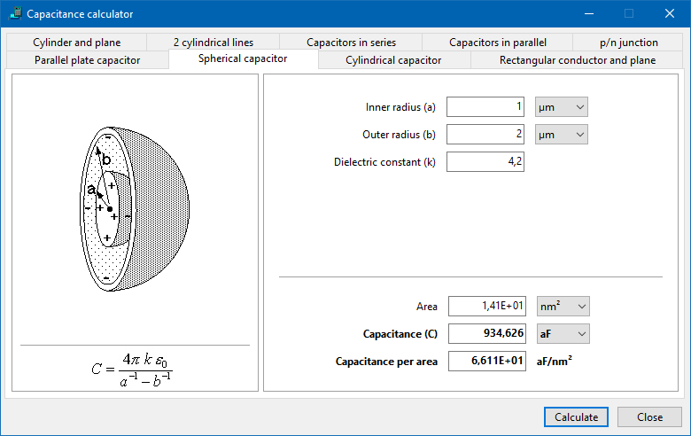

# CapaCalc



## Introduction

CapaCalc is a desktop application designed to compute the electrical capacitance for several common conductor configurations and capacitor network arrangements. It is developed using Free Pascal and Lazarus IDE, requiring no external third-party components. The calculations cover fundamental geometries, series/parallel combinations, and the capacitance of a semiconductor p/n junction. The application provides a graphical user interface (GUI) for easy interaction and displays relevant formulas and geometries where applicable.

## Compilation

The application is distributed as Pascal source code only. It can be compiled with Lazarus v2.0+/FPC3.0+ (or potentially older versions, though not explicitly tested). No third-party components are needed.

Tested on Windows 32bit/64 bit and Linux 64 bit, but it should work also on other platforms supported by Lazarus.

To compile:
1.  Ensure you have Lazarus IDE and Free Pascal Compiler installed.
2.  Open the `source/CapaCalc.lpr` project file in Lazarus.
3.  Build the project (`Run -> Build All Project Files` or press Shift+F9).
4.  The executable will be generated in the project directory.

## Core Units and String Resources

This section describes the units (`ccGlobal.pas`) and string resources (`ccStrings.pas`) used throughout the application, which are fundamental to its operation and extensibility.

### `ccGlobal.pas`: Physical Constants and Unit Factors

This unit defines fundamental physical constants, enumeration types for various units, and conversion factors used to handle calculations across different unit systems.

All calculations within the application are performed using **Standard International (SI) units** (meters, Farads, Volts per meter, per cubic meter, etc.). Input values are converted from the user-selected units to their corresponding SI values upon reading, and calculated results are converted back to user-selected units for display in the UI.

**Key Physical Constants Defined:**

*   `eps0 = 8.854187817E-12; // F/m` (Permittivity of free space in Farads per meter)
*   `q = 1.60217733E-19; // C` (Elementary charge in Coulombs)
*   `kB = 1.380658E-23; // Boltzmann constant (J/K)` (Boltzmann constant in Joules per Kelvin)
*   `Pi = 3.1415926535897932384626;` (Mathematical constant Pi)
*   `TwoPi = 6.2831853071795864769253; // 2*Pi` (Mathematical constant Two Pi)

**Unit Enumeration Types:**

Enums are used to represent the different available units for various physical quantities:
*   `TLenUnits = (lu_nm, lu_Microns, lu_cm, lu_m);` (Length units: nanometers, micrometers, centimeters, meters)
*   `TAreaUnits = (au_nm2, au_Microns2, au_cm2, au_m2);` (Area units: square nanometers, square micrometers, square centimeters, square meters)
*   `TVolumeUnits = (vu_nm3, vu_Microns3, vu_cm3, vu_m3);` (Volume units: cubic nanometers, cubic micrometers, cubic centimeters, cubic meters)
*   `TCapaUnits = (cu_aF, cu_fF, cu_pF, cu_nF, cu_F);` (Capacitance units: attoFarads, femtoFarads, picoFarads, nanoFarads, Farads)
*   `TEFieldUnits = (eu_mV_nm, eu_V_micron, eu_kV_cm, eu_MV_m, eu_V_m);` (Electric Field units: millivolts per nanometer, Volts per micrometer, kilovolts per centimeter, Megavolts per meter, Volts per meter)
*   `TTempUnits = (tuK, tuC);` (Temperature units: Kelvin, Celsius)
*   `TMaterial = (mSi, mGaAs, mGe, mInP);` (Semiconductor materials: Silicon, Gallium Arsenide, Germanium, Indium Phosphide)

**Unit Conversion Factor Arrays:**

Arrays indexed by the unit enumeration types store the conversion factor from that unit to the corresponding SI unit.
*   `LenFactor : array[TLenUnits] of double = ( 1E-9, 1E-6, 1E-2, 1.0);`
*   `AreaFactor : array[TAreaUnits] of double = ( 1E-18, 1E-12, 1E-4, 1.0);`
*   `VolumeFactor : array[TVolumeUnits] of double = ( 1E-27, 1E-18, 1E-6, 1.0);`
*   `CapaFactor : array[TCapaUnits] of double = ( 1E-18, 1E-15, 1E-12, 1E-9, 1.0 );`
*   `EFieldFactor : array[TEFieldUnits] of double = ( 1E-3/1E-9, 1.0/1E-6, 1E3/1E-2, 1E6/1, 1.0 );`

**Example of Unit Conversion in Code:**

Input values are read as strings, converted to `Extended` (double), and then multiplied by the appropriate factor based on the selected unit's item index in the corresponding `TComboBox`.
```pascal
// Reading and converting an input length value from a TEdit and TComboBox
var
  L_input_value: Extended; // Value read from edit field
  L_si: Extended; // Value in SI units (meters)
  LengthUnitsIndex: Integer; // Index from the units combobox

LengthUnitsIndex := CbLengthUnits.ItemIndex; // Get selected unit index
TryStrToFloat(EdLength.Text, L_input_value); // Read value from edit field
L_si := L_input_value * LenFactor[TLenUnits(LengthUnitsIndex)]; // Convert to meters
```
Output values, calculated in SI units, are converted back to the desired display units by dividing by the appropriate factor before formatting.
```pascal
// Converting a calculated capacitance value from SI (Farads) to display units
var
  capa_si: Extended; // Calculated capacitance in Farads
  capa_display: Extended; // Capacitance in display units
  CapaUnitsIndex: Integer; // Index from the units combobox

// ... capa_si is calculated ...

CapaUnitsIndex := CbCapaUnits.ItemIndex; // Get selected unit index
capa_display := capa_si / CapaFactor[TCapaUnits(CapaUnitsIndex)]; // Convert to display units
TxtCapa.Text := FormatFloat(CapaStdFormat, capa_display); // Format and display
```

**Semiconductor Material Properties:**
*   `MaterialEps : array [TMaterial] of double`: Stores the relative permittivity ($\epsilon_r$) multiplied by $\epsilon_0$ for supported materials, giving $\epsilon_s$ in F/m.
*   `ni : array [TMaterial] of double`: Stores the intrinsic carrier concentration ($n_i$) in 1/cm³ for supported materials *at 300K*.

**Format Strings:**
Standard format strings for displaying numbers in results fields:
*   `CapaExpFormat = '0.000E+00';` (Scientific notation)
*   `CapaStdFormat = '0.000';` (Standard decimal format)
*   `CapaPerAreaFormat = '0.000E+00';`
*   `CapaPerLengthFormat = '0.000E+00';`
*   `ConcFormat = '0.00E+00';` (Format for concentrations)
*   `LenStdFormat = '0.00';` (Standard decimal format for length/width/height/distance)
*   `AreaStdFormat = '0.00E+00';` (Format for area)

### `ccStrings.pas`: String Resources

This unit contains `resourcestring` definitions for all user-facing text elements within the application's GUI and message dialogs. This includes labels for input fields, captions for tabs and buttons, error messages, and informational text (like accuracy notes). Centralizing these strings simplifies text management and is a key practice for software internationalization (although only English strings are currently provided).

Example `resourcestring` definitions:
```pascal
resourcestring
  SAccuracy2Percent = 'Accuracy ca. 2%';
  SInputRequired = 'Input required.';
  SNumberRequired = 'Number required in this field.';
  SPositiveNumberRequired = 'Positive number required.';
  SRadiusNotLargerThanHalfDistance = 'Radius cannot be larger than half-distance.';
  SSphereRadiiMustNotBeEqual = 'The sphere radii must not be equal.';
  STemperatureDependenceNotSupported = 'Temperature dependence of this material not supported.';
  STemperaturePositive = 'Temperature in Kelvin must be a positive number.';
  SVoltageMustBeSmallerThanBuiltIn = 'The applied voltage must be smaller then the built-in voltage (%f V)';
  SParameterError = 'Parameter error';
  // ... and many others for labels and captions
```

## Supported Capacitance Calculations

CapaCalc provides detailed calculations for the following conductor arrangements and circuits. For each type, the formula used by the application, the required inputs, generated outputs, relevant source files, and validation rules are described. Code snippets illustrate how the core calculation is implemented.

### Parallel Plate Capacitor

*   **Description:** Calculates the capacitance of two parallel conducting plates separated by a dielectric material. This is a fundamental model for many capacitor designs.
*   **Source Files:** `source/ccplanarcapframe.pas`, `source/ccplanarcapframe.lfm`
*   **Inputs:**
    *   Plate distance (d) [Code variable: `d`]
    *   Plate length (L) [Code variable: `L`]
    *   Plate width (B) [Code variable: `W`]
    *   Dielectric constant (k) [Code variable: `eps`]
    *   Input units for d, L, B (Length Units, selected by user)
    *   Input units for output Area (Area Units, selected by user)
    *   Input units for output Capacitance, Capacitance per area, Capacitance per length (Capa Units, selected by user)
*   **Outputs:**
    *   Area [Code variable: `A`] (Calculated as `W * L`)
    *   Capacitance (C) [Code variable: `capa`]
    *   Capacitance per area (Calculated as `capa / A`)
    *   Capacitance per length (Calculated as `capa / L`)
    *   Output units are selected by the user for Area and Capacitance. Capacitance per area/length units are derived and displayed.
*   **Formula:** The capacitance $C$ is calculated using the standard formula for a parallel plate capacitor:
    $$C = \epsilon_0 \epsilon_r \frac{A}{d}$$
    where $\epsilon_0$ is the permittivity of free space, $\epsilon_r$ is the relative dielectric constant (input 'k'), $A$ is the area of the plates ($L \times B$), and $d$ is the distance between the plates.
*   **Validation (`TPlanarCapFrame.ValidData`):** Distance (d), Length (L), and Width (W) must be positive numbers. Dielectric constant (k / eps) must be a number. All unit comboboxes (Dist, Length, Width, Area, Capa) must have a selected value.
*   **Real-World Idea:** This model is used extensively in designing printed circuit board (PCB) traces as capacitors, parallel plate capacitors for energy storage, or estimating parasitic capacitance between conducting layers.

### Spherical Capacitor

*   **Description:** Calculates the capacitance of a spherical capacitor, which consists of two concentric conducting spheres of radii $a$ and $b$ ($b > a$) separated by a dielectric medium.
*   **Source Files:** `source/ccsphericalcapframe.pas`, `source/ccsphericalcapframe.lfm` (inherits from `ccBaseFrame`)
*   **Inputs:**
    *   Inner radius (a) [Code variable: `ra`]
    *   Outer radius (b) [Code variable: `rb`]
    *   Dielectric constant (k) [Code variable: `eps`]
    *   Input units for a, b (Length Units, selected by user)
    *   Input units for output Area (Area Units, selected by user)
    *   Input units for output Capacitance, Capacitance per area (Capa Units, selected by user)
*   **Outputs:**
    *   Area [Code variable: `A`] (Calculated as `1.0/6.0 * pi *(ra + rb)*(ra + rb)*(ra + rb)`. **Clarification:** This calculated value is **not** a standard geometric area (like the surface area of either sphere or the gap between them). It appears to be derived from an intermediate term in a different, possibly volume-related, context. Its primary purpose in the UI is as the denominator for calculating "Capacitance per area" for display purposes. This "Capacitance per area" is therefore also based on this non-standard 'Area' value and should be interpreted with caution regarding standard physical units like F/m². The core, meaningful output for this geometry is the total Capacitance (C).)
    *   Capacitance (C) [Code variable: `Capa`]
    *   Capacitance per area (Calculated as `Capa / A`, using the non-standard 'Area' value)
    *   Output units are selected by the user.
*   **Formula:** The capacitance $C$ is calculated using the standard formula for a spherical capacitor:
    $$C = 4 \pi \epsilon_0 \epsilon_r \frac{ab}{b-a} = 4 \pi \epsilon_0 \epsilon_r \frac{1}{\frac{1}{a} - \frac{1}{b}}$$
    where $\epsilon_0$ is the permittivity of free space, $\epsilon_r$ is the relative dielectric constant (input 'k'), $a$ is the inner radius, and $b$ is the outer radius.
*   **Validation (`TSphericalCapFrame.ValidData`):** Inner radius (a), Outer radius (b), and Dielectric constant (k / eps) must be numbers. Both radii must be positive. The inner radius (a) must be strictly smaller than the outer radius (b). All unit comboboxes (Radius A, Radius B, Area, Capa) must have a selected value.
*   **Real-World Idea:** Used in the design of some high-voltage electrodes, ionization chambers, or as a conceptual model in electrostatics.

### Cylindrical Capacitor

*   **Description:** Calculates the capacitance of a cylindrical capacitor, typically consisting of two concentric conducting cylinders of radii $a$ and $b$ ($b > a$) and length $L$, separated by a dielectric. This geometry is characteristic of coaxial cables.
*   **Source Files:** `source/cccylindricalcapframe.pas`, `source/cccylindricalcapframe.lfm` (inherits from `TSphericalCapFrame` for UI elements and some methods, but overrides `Calculate` and related properties/methods)
*   **Inputs:**
    *   Inner radius (a) [Code variable: `ra` (inherited)]
    *   Outer radius (b) [Code variable: `rb` (inherited)]
    *   Length (L) [Code variable: `L`]
    *   Dielectric constant (k) [Code variable: `eps` (inherited)]
    *   Input units for a, b, L (Length Units, selected by user)
    *   Input units for output Area (Area Units, selected by user)
    *   Input units for output Capacitance, Capacitance per area, Capacitance per length (Capa Units, selected by user)
*   **Outputs:**
    *   Area [Code variable: `A`] (Calculated as $\pi (ra + rb) L$. **Clarification:** This calculated value is **not** the standard geometric area used in the analytical capacitance formula ($2\pi a L$ or $2\pi b L$). It represents a simplified surface area calculation ($\pi$ times the sum of radii times length), which is used as the denominator for calculating "Capacitance per area" for display purposes. The "Capacitance per area" output is therefore based on this non-standard 'Area' value and should be interpreted with caution. The primary standard output for this geometry is the total Capacitance (C) or, more commonly for transmission lines, the Capacitance per length.)
    *   Capacitance (C) [Code variable: `capa`]
    *   Capacitance per area (Calculated as `capa / A`, using the non-standard 'Area' value)
    *   Capacitance per length (Calculated as `capa / L`)
    *   Output units are selected by the user.
*   **Formula:** The capacitance $C$ is calculated using the standard formula for a cylindrical capacitor:
    $$C = 2 \pi \epsilon_0 \epsilon_r \frac{L}{\ln(\frac{b}{a})}$$
    where $\epsilon_0$ is the permittivity of free space, $\epsilon_r$ is the relative dielectric constant (input 'k'), $L$ is the length, $a$ is the inner radius, and $b$ is the outer radius.
*   **Validation (`TCylindricalCapFrame.ValidData`):** Inner radius (a), Outer radius (b), Length (L), and Dielectric constant (k / eps) must be numbers. All inputs must be positive. The inner radius (a) must be strictly smaller than the outer radius (b). All unit comboboxes (Radius A, Radius B, Length, Area, Capa) must have a selected value.
*   **Real-World Idea:** Essential for designing and analyzing coaxial cables used in communication and RF systems, or cylindrical capacitors for power electronics.

### Capacitance between Rectangular Conductor and Conducting Plane

*   **Description:** Calculates the capacitance between a rectangular conductor placed parallel to and above a large conducting plane (ground plane). This configuration is relevant in microstrip lines and estimating parasitic capacitance.
*   **Source Files:** `source/cclineplanecapframe.pas`, `source/cclineplanecapframe.lfm` (inherits from `TPlanarCapFrame` for UI structure, but overrides `Calculate`, `ValidData`, and related properties/methods)
*   **Inputs:**
    *   Distance (d) from the conductor's bottom to the plane [Code variable: `d`]
    *   Conductor length (L) [Code variable: `L`]
    *   Conductor width (B) [Code variable: `W`]
    *   Conductor height (H) [Code variable: `H`]
    *   Dielectric constant (k) [Code variable: `eps`]
    *   Input units for d, L, B, H (Length Units, selected by user)
    *   Input units for output Capacitance, Capacitance per length (Capa Units, selected by user)
*   **Outputs:**
    *   Capacitance (C) [Code variable: `capa`]
    *   Capacitance per length (Calculated as `capa / L`)
    *   Output units are selected by the user.
*   **Formula:** The capacitance $C$ is calculated using an approximate formula suitable for microstrip-like geometries:
    $$C = \epsilon_0 \epsilon_r L \left(\frac{B}{d} + 0.77 + 1.06\sqrt{\sqrt{\frac{B}{d}}} + 1.06\sqrt{\frac{H}{d}}\right)$$
    where $\epsilon_0$ is the permittivity of free space, $\epsilon_r$ is the relative dielectric constant (input 'k'), $L$ is the conductor length, $B$ is the conductor width, and $H$ is the conductor height, and $d$ is the distance to the plane.
*   **Validation (`TLinePlaneCapFrame.ValidData`):** Distance (d), Length (L), Width (B), and Height (H) must be positive numbers. Dielectric constant (k / eps) must be a number. All unit comboboxes (Dist, Length, Width, Height, Capa) must have a selected value.
*   **Accuracy Note:** The formula used is an approximation. The accuracy is noted in the application based on the ratios of conductor width (B) to distance (d) (`Wd`) and conductor height (H) to distance (d) (`Hd`). Refer to the `SAccuracy2Percent`, `SAccuracy6Percent`, and `SInaccurate` strings in `ccStrings.pas` and the logic in `TLinePlaneCapFrame.Calculate` for the specific conditions.
*   **Real-World Idea:** Calculating the capacitance of a microstrip line on a PCB, where the rectangular conductor is the trace and the plane is the ground layer.

### Capacitance between Cylindrical Conductor and Conducting Plane

*   **Description:** Calculates the capacitance between a cylindrical conductor placed parallel to and above a large conducting plane (ground plane).
*   **Source Files:** `source/cccylplanecapframe.pas`, `source/cccylplanecapframe.lfm` (inherits from `ccBaseFrame`)
*   **Inputs:**
    *   Line center-to-plane distance (d) [Code variable: `d`]
    *   Cylinder radius (r) [Code variable: `R`]
    *   Length (L) [Code variable: `L`]
    *   Dielectric constant (k) [Code variable: `eps`]
    *   Input units for d, r, L (Length Units, selected by user)
    *   Input units for output Capacitance, Capacitance per length (Capa Units, selected by user)
*   **Outputs:**
    *   Capacitance (C) [Code variable: `Capa`] (Calculated by the `DoCalc` function, which includes the length `L`. The application then calculates 'Capacitance per length' by dividing this result by L.)
    *   Capacitance per length (Calculated as `Capa / L`)
    *   Output units are selected by the user.
*   **Formula:** The capacitance $C$ is calculated using the method of images, yielding the formula:
    $$C = 2 \pi \epsilon_0 \epsilon_r \frac{L}{\ln\left(\frac{d + \sqrt{d^2 - r^2}}{r}\right)}$$
    where $\epsilon_0$ is the permittivity of free space, $\epsilon_r$ is the relative dielectric constant (input 'k'), $L$ is the length, $d$ is the distance from the cylinder center to the plane, and $r$ is the cylinder radius.
*   **Validation (`TCylPlaneCapFrame.ValidData`):** Distance (d), Radius (r), Length (L), and Dielectric constant (k / eps) must be numbers. All inputs must be positive. The radius (r) must be strictly smaller than the distance (d). The term `d*d - R*R` inside the square root must be non-negative, which is guaranteed if d > R. The argument of the logarithm `(d + sqrt(d*d - R*R))/R` must be positive. All unit comboboxes (Dist, Radius, Length, Capa) must have a selected value.
*   **Real-World Idea:** Estimating parasitic capacitance between a wire and a ground plane, or modeling the capacitance of single transmission lines.

### Capacitance between Two Cylinders

*   **Description:** Calculates the capacitance between two parallel cylindrical conductors. This is relevant for twin-lead transmission lines or estimating coupling between wires.
*   **Source Files:** `source/cc2cylcapframe.pas` (inherits from `ccCylPlaneCapFrame` for UI elements and some methods, but overrides `DoCalc` and `ValidData`), `source/cccylplanecapframe.pas` (defines the inherited `Calculate` method), `source/cc2cylcapframe.lfm` (inherits from `ccCylPlaneCapFrame.lfm`)
*   **Inputs:**
    *   Center-to-center distance (d) [Code variable: `d` (inherited from `ccCylPlaneCapFrame`)]
    *   Cylinder radius (R) [Code variable: `R` (inherited from `ccCylPlaneCapFrame`)]
    *   Length (L) [Code variable: `L` (inherited from `ccCylPlaneCapFrame`)]
    *   Dielectric constant (k) [Code variable: `eps` (inherited from `ccCylPlaneCapFrame`)]
    *   Input units for d, R, L (Length Units, selected by user)
    *   Input units for output Capacitance, Capacitance per length (Capa Units, selected by user)
*   **Outputs:**
    *   Capacitance (C) [Code variable: `Capa` (in `ccCylPlaneCapFrame.pas`)] (Calculated by the overridden `DoCalc` function in `TTwoCylCapFrame.pas`, which includes the length `L`. The application then calculates 'Capacitance per length' by dividing this result by L.)
    *   Capacitance per length (Calculated as `Capa / L`)
    *   Output units are selected by the user.
*   **Formula:** The capacitance $C$ between two parallel cylinders is calculated using the formula:
    $$C = \pi \epsilon_0 \epsilon_r \frac{L}{\ln\left( \frac{d/2 + \sqrt{(d/2)^2 - R^2}}{R} \right)}$$
    where $\epsilon_0$ is the permittivity of free space, $\epsilon_r$ is the relative dielectric constant (input 'k'), $L$ is the length, $d$ is the center-to-center distance, and $R$ is the cylinder radius.
*   **Validation (`TTwoCylCapFrame.ValidData`):** Center-to-center distance (d), Radius (R), Length (L), and Dielectric constant (k / eps) must be numbers. R and d must be positive. Half of the distance (d/2) must be strictly greater than the radius (R). The term `(d/2)^2 - R^2` inside the square root must be non-negative, which is guaranteed if d/2 > R. The argument of the logarithm `(d/2 + sqrt((d/2)^2 - R^2))/R` must be positive. All unit comboboxes (Dist, Radius, Length, Capa) must have a selected value.
*   **Real-World Idea:** Modeling twin-lead transmission lines or estimating the coupling capacitance between adjacent wires in a bundle.

### Capacitors in Series

*   **Description:** Calculates the equivalent total capacitance of multiple capacitors connected in series. The application supports up to 8 individual capacitors.
*   **Source Files:** `source/ccseriescapframe.pas` (inherits from `ccManyCapFrame`), `source/ccmanycapframe.pas`, `source/ccseriescapframe.lfm` (inherits from `ccManyCapFrame.lfm`)
*   **Inputs:**
    *   Up to 8 individual capacitance values (C1 to C8) [Code variables: `FEditArray` - an array of `TEdit` in `TManyCapFrame`]
    *   **Important:** All input capacitance values should be in the *same* units. The application displays a reminder "Same units!".
*   **Outputs:**
    *   Total capacitance (C) [Code variable: `capa` in `TManyCapFrame`]
    *   The number of decimal places for the output can be adjusted using an up/down control.
*   **Formula:** The total capacitance $C_{total}$ for $n$ capacitors connected in series is calculated using the reciprocal of the sum of the reciprocals of individual capacitances:

$$ \frac{1}{C_{total}} = \sum_{i=1}^{n} \frac{1}{C_i} \quad \implies \quad C_{total} = \frac{1}{\sum_{i=1}^{n} \frac{1}{C_i}} $$
    
*   **Validation (`TManyCapFrame.ValidData`):** Any non-empty input fields must contain positive numbers.
*   **Real-World Idea:** Analyzing voltage division across capacitors in AC circuits, or calculating the effective capacitance of components fabricated on different layers in microelectronics.

### Capacitors in Parallel

*   **Description:** Calculates the equivalent total capacitance of multiple capacitors connected in parallel. The application supports up to 8 individual capacitors.
*   **Source Files:** `source/ccparallelcapframe.pas` (inherits from `ccManyCapFrame`), `source/ccmanycapframe.pas`, `source/ccparallelcapframe.lfm` (inherits from `ccManyCapFrame.lfm`)
*   **Inputs:**
    *   Up to 8 individual capacitance values (C1 to C8) [Code variables: `FEditArray` - an array of `TEdit` in `TManyCapFrame`]
    *   **Important:** All input capacitance values should be in the *same* units. The application displays a reminder "Same units!".
*   **Outputs:**
    *   Total capacitance (C) [Code variable: `capa` in `TManyCapFrame`]
    *   The number of decimal places for the output can be adjusted using an up/down control.
*   **Formula:** The total capacitance $C_{total}$ for $n$ capacitors connected in parallel is calculated as the direct sum of the individual capacitances:
    $$C_{total} = \sum_{i=1}^{n} C_i$$
*   **Validation (`TManyCapFrame.ValidData`):** Any non-empty input fields must contain positive numbers.
*   **Real-World Idea:** Calculating the total capacitance of multiple components connected across the same two nodes in a circuit, or analyzing charge sharing in switching circuits.

### Semiconductor p/n Junction Capacitance

*   **Description:** Calculates key parameters of a semiconductor p/n junction, including built-in voltage, depletion width, maximum electric field, and capacitance per area. It supports both abrupt and linearly-graded doping profiles.
*   **Source Files:** `source/ccpnjunctioncapframe.pas`, `source/ccpnjunctioncapframe.lfm` (inherits from `ccBaseFrame`)
*   **Inputs:**
    *   Material [Code variable: `material` (enum `TMaterial`), mapped from `CbMaterial.ItemIndex`]
    *   Temperature [Code variable: `T`] (Input units: K or °C, selected by user)
    *   Junction type [Code variable: `CbJctType.ItemIndex`] (0 for abrupt, 1 for linearly-graded)
    *   Applied voltage (V) [Code variable: `V`] (using `TFloatSpinEdit`, always in Volts)
    *   **For abrupt junction (when Junction type is 'abrupt'):**
        *   Acceptor concentration (Na) [Code variable: `NA`] (Input units: 1/nm³, 1/µm³, 1/cm³, or 1/m³, selected by user)
        *   Donor concentration (Nd) [Code variable: `ND`] (Input units: 1/nm³, 1/µm³, 1/cm³, or 1/m³, selected by user)
    *   **For linearly-graded junction (when Junction type is 'linearly-graded'):**
        *   Dopand concentration change (a) [Code variable: `deltaConc` from UI, `a` for calculation] (Input units: 1/nm³, 1/µm³, 1/cm³, or 1/m³, selected by user). **Note on Units:** The UI label "Dopand concentration change" also shows "per micron" next to the unit combobox in the UI (`LblDeltaConcPerMicron`). The code reads the input numerical value and the selected *volume* unit from the combobox (`CbDeltaConcUnits`). It converts the value to 1/m³ using `VolumeFactor` and then **multiplies by 1E6** (`a_si := deltaConc_input * fdN * 1E6;`). This effectively treats the input as a concentration change *per micrometer* (per $10^{-6}$ m), resulting in the concentration gradient `a_si` having units of (1/m³) / ($10^{-6}$ m) = $10^6$ / m⁴ = 1/m⁴. The UI might be clearer if it requested "Dopant change rate (dN/dx)" and showed derived units like "(1/m³)/µm" or just "1/m⁴".
    *   Input units for output EMax (EField Units, selected by user)
    *   Input units for output Depletion Width (Length Units, selected by user)
    *   Input units for output Capa per Area (Area Units, selected by user, combined with selected Capa Units)
*   **Outputs:**
    *   Maximum electric field (EMax) [Code variable: `emax`]
    *   Built-in voltage (V0) [Code variable: `V0`] (Always displayed in Volts)
    *   Depletion width (W) [Code variable: `W`]
    *   Capacitance per area (Cj) [Code variable: `Cj`] (Displayed with units like nF/cm², derived from user Capa Unit and Area Unit selection)
    *   Output units are selected by the user for EMax, Depletion Width, and the components (Capa/Area) of Capa per Area units.
*   **Formulas (Implemented in `TPNJunctionCapFrame.Calculate`, `Calc_BuiltinVoltage`, and `FindRoot`):**
    *   **Semiconductor Permittivity:** $\epsilon_s = \epsilon_r \epsilon_0$, obtained from the `MaterialEps` array in `ccGlobal.pas` based on the selected material.
    *   **Intrinsic Carrier Concentration:** $n_i$ is obtained from the `Calc_ni` function, which is temperature-dependent for Silicon but uses fixed 300K values for other materials in the `ni` array.
    *   **General (Capacitance per area):** $C_j = \frac{\epsilon_s}{W}$, where $W$ is the depletion width.
    *   **Abrupt junction:**
        *   Built-in voltage: $V_0 = \frac{kT}{q} \ln\left(\frac{N_a N_d}{n_i^2}\right)$
        *   Depletion width: $W = \sqrt{\frac{2 \epsilon_s (V_0 - V)}{q} \left(\frac{1}{N_a} + \frac{1}{N_d}\right)}$ (Implemented as `sqrt (2 * MaterialEps[material]/q * (NA_si + ND_si)/(NA_si * ND_si) * (V0 - V_applied) )` in code, where NA_si and ND_si are in 1/m³)
        *   Maximum field: $E_{max} = \frac{2 (V_0 - V)}{W}$ (**Note:** The code uses this simplified formula for EMax, which is equivalent to the standard formula $E_{max} = \frac{q N_a N_d W}{\epsilon_s (N_a + N_d)}$ when the expression for $W$ is substituted. Both formulas are standard for abrupt junctions.)
    *   **Linearly-graded junction:**
        *   Depletion width ($W$) and Built-in voltage ($V_0$) are solved from the coupled equations:
            *   $W = \left(\frac{12 \epsilon_s (V_0 - V)}{q a}\right)^{1/3}$
            *   $V_0 = \frac{2kT}{q} \ln\left(\frac{a W}{2 n_i}\right)$
        The code attempts to solve this nonlinear system using the `FindRoot` function (an implementation of the Brent method). If `FindRoot` fails, an approximate solution is used: $V_0 \approx \frac{2}{3} \frac{kT}{q} \ln\left(\frac{a^2 \epsilon_s kT/q}{8 q n_i^3}\right) + 0.075$ V. This approximation includes an empirical offset of 0.075V as noted in the source code's comment.
        *   Maximum field: $E_{max} = \frac{q a W^2}{8 \epsilon_s}$
    *   $k$: Boltzmann constant, $q$: elementary charge, $T$: temperature, $n_i$: intrinsic carrier concentration, $\epsilon_s$: semiconductor permittivity, $a$: concentration gradient (in 1/m⁴).
*   **Validation (`TPNJunctionCapFrame.ValidData`):** Material, Temp Units, Junction type, EMax Units, Depletion Width Units comboboxes must have a selected value. Temperature must be a number, and positive if in Kelvin. Applied Voltage must be a number. Na and Nd must be positive numbers if junction type is abrupt. Delta Conc must be a number if junction type is linearly-graded. All unit comboboxes must have a selected value. Additionally, the applied voltage is validated against the *calculated* built-in voltage (must be smaller).
*   **Temperature Dependence:** The intrinsic carrier concentration ($n_i$) is temperature-dependent and calculated by `Calc_ni`. **Crucially, `Calc_ni` only implements the temperature dependence for Silicon.** For GaAs, Germanium, and InP, it uses a fixed value corresponding to 300K from the `ni` array in `ccGlobal.pas`. If a temperature significantly different from 300K is entered for these materials, the application will show the error message "Temperature dependence of this material not supported.".
*   **Real-World Idea:** This is the core calculation for semiconductor diodes and forms the basis for understanding transistor operation (e.g., C-V characteristics of the base-emitter and base-collector junctions). It's vital for device design, characterization, and circuit modeling.

## Real-World Applications and Problem Solving Ideas

CapaCalc can be a useful tool for students, engineers, and researchers working with electrical circuits and semiconductor devices. By providing specific calculation models, it serves as a useful educational tool and a practical utility in various fields of electrical engineering and physics. Here are some ideas on how the different calculation types can be applied:

*   **Circuit Design:** Calculating the equivalent capacitance of multiple components using the Series and Parallel tabs is fundamental for designing and analyzing passive filters (e.g., high-pass, low-pass), resonant circuits, timing circuits, and impedance matching networks. You can combine multiple standard capacitor values to achieve a desired total capacitance not available commercially.
*   **PCB Design and Parasitics:** Estimating unwanted (parasitic) capacitance is critical for high-speed digital, RF, and mixed-signal PCB design. The Planar (trace-to-plane, layer-to-layer), Line-Plane (trace-to-ground), and Two Cylinder (trace-to-trace coupling) tabs allow engineers to model these effects and mitigate signal integrity issues, cross-talk, and unexpected frequency responses.
*   **Semiconductor Device Physics and Design:** The p/n junction tab is invaluable for understanding the behavior of diodes and the junctions within bipolar transistors and FETs. It allows exploring how doping profiles (abrupt vs. graded) and applied voltage affect key parameters like built-in voltage, depletion region width, maximum electric field (critical for breakdown voltage), and junction capacitance. This is essential for device design, characterization, and circuit modeling.
*   **Coaxial Cables and Transmission Lines:** The Cylindrical Capacitor model is directly applicable to determining the capacitance per unit length of coaxial cables, which, along with inductance, defines the cable's characteristic impedance – a crucial parameter for signal transmission without reflections.
*   **High Voltage Engineering:** The spherical and cylindrical capacitor models can be applied to analyze electric field stress and capacitance in high-voltage components, insulators, or bushings, helping to prevent dielectric breakdown.
*   **Electrode Design and Sensor Applications:** The parallel plate model is foundational for designing simple capacitors used in energy storage, but also for designing capacitive sensors (e.g., for displacement, pressure, humidity) where changes in geometry or dielectric constant alter the capacitance. The other geometry models are also applicable to various sensor types.
*   **Education and Learning:** CapaCalc serves as an interactive tool for students to visualize geometries (via images) and immediately see the impact of changing parameters on capacitance values, reinforcing theoretical concepts.

## Extending CapaCalc

Developers interested in adding new capacitance calculations or improving existing ones can contribute to the CapaCalc project. The modular structure, based on `TBaseFrame` descendants, makes it relatively straightforward to add new calculation types.

1.  **Create New Frame:** Define a new Pascal unit (e.g., `ccNewCapFrame.pas`) and its corresponding Lazarus Form file (`ccNewCapFrame.lfm`). The new unit should inherit from `ccBaseFrame` or a relevant existing frame class if applicable (e.g., `ccManyCapFrame` for series/parallel calculations).
2.  **Design UI:** Use the Lazarus IDE to design the visual layout of the new frame in the `.lfm` file. Add input controls (like `TEdit`, `TComboBox`, `TFloatSpinEdit`) and display controls (`TEdit`, `TLabel`) as needed for the specific calculation. Use descriptive `TLabel` captions from `ccStrings.pas`. Consider adding `TImage` components for geometry and formula illustrations if helpful.
3.  **Implement Calculation Logic:** In the `.pas` unit, implement the capacitance formula and any related calculations (e.g., area, field) in the `Calculate` method.
    *   Read input values from the UI controls (e.g., `StrToFloat(EdInput.Text)`).
    *   Convert input values from their selected units to SI units using the appropriate factor arrays (`LenFactor`, `AreaFactor`, `VolumeFactor`, etc.) from `ccGlobal.pas` based on the selected `TComboBox` item index (which should correspond to the `TLenUnits`, `TAreaUnits`, etc., enums).
    *   Perform the core physics calculation using the SI unit values and constants from `ccGlobal.pas`. Handle potential mathematical issues (e.g., logarithm of non-positive number, square root of negative number, division by zero) by checking inputs or calculation intermediate results and raising exceptions with messages from `ccStrings.pas`.
    *   Convert calculated results from SI units to the user-selected output units by dividing by the appropriate factor arrays from `ccGlobal.pas`.
    *   Display results in the appropriate output controls, formatted using functions like `FormatFloat` with format strings from `ccGlobal.pas` or `NumToStr` from `ccPNJunctionCapFrame.pas` if similar formatting is desired.
    *   Optionally, use the `OnCalcComplete` event to provide accuracy notes or status messages, referencing strings from `ccStrings.pas`.
4.  **Implement Input Validation:** Override the `ValidData` function to perform checks on the user's input *before* calculation is attempted. This function should return `True` if the data is valid and `False` otherwise. If invalid, set the `AMsg` parameter to an appropriate error message (preferably using strings from `ccStrings.pas`) and the `AControl` parameter to the input control that has the validation error, allowing the main form to highlight it. Use helper functions like `IsValidNumber`, `IsValidPositive`, `IsValidComboValue` from `ccBaseFrame`.
5.  **Integrate into Main Form:** Modify the `ccMain.pas` and `ccMain.lfm` files to include the new frame in the application's main window:
    *   Add the new unit to the `uses` clause of `ccMain.pas`.
    *   Open `ccMain.lfm` in Lazarus and add a new `TTabSheet` to the `PageControl`. Set its `Caption` property to the desired text for the new calculator tab.
    *   In the `TMainForm.FormCreate` procedure in `ccMain.pas`, add a line to associate the new tab sheet with the new frame class, for example: `MyNewTabSheet.Tag := {%H-}PtrUInt(TccNewCapFrame);`. Replace `MyNewTabSheet` with the actual name of the `TTabSheet` component you added and `TccNewCapFrame` with the class name of your new frame.
6.  **Add New Units/Constants (if needed):** If your new calculation requires units or physical constants not already defined, add them to `ccGlobal.pas`.
7.  **Add New String Resources (if needed):** If your new UI or validation requires new text, add them as `resourcestring` in `ccStrings.pas`.
8.  **Implement INI Persistence:** Override `ReadFromIni` and `WriteToIni` in your new frame unit to load and save the input values and unit selections from the application's INI file, allowing the application to remember user settings.
9.  **Add Documentation:** Update the main README file (this file) to include a detailed description of the new calculation type, its inputs (including code variable names and units), outputs (including code variable names and units), the formula used, relevant code files, any specific validation or accuracy notes, and real-world application ideas. Include code snippets for the core calculation logic.


